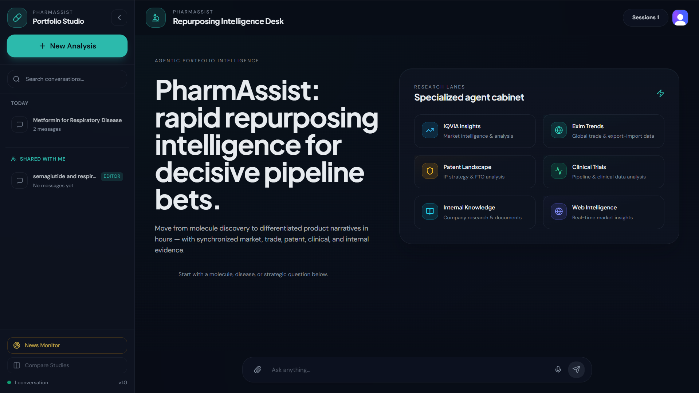
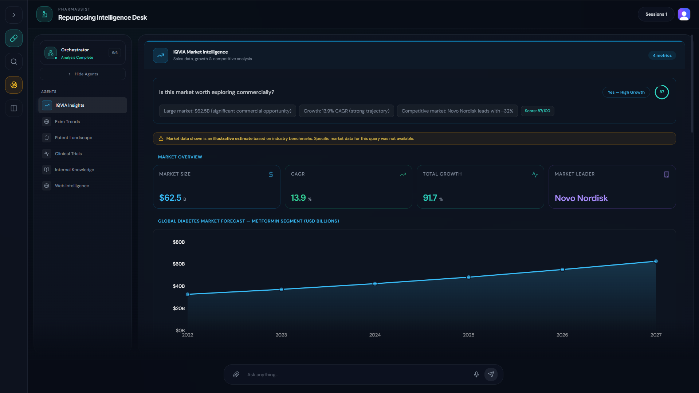
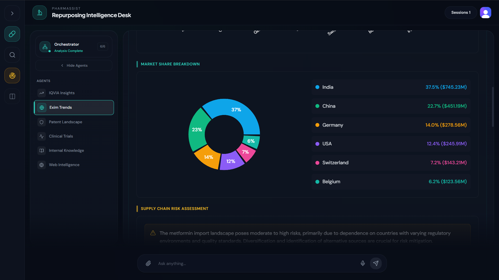
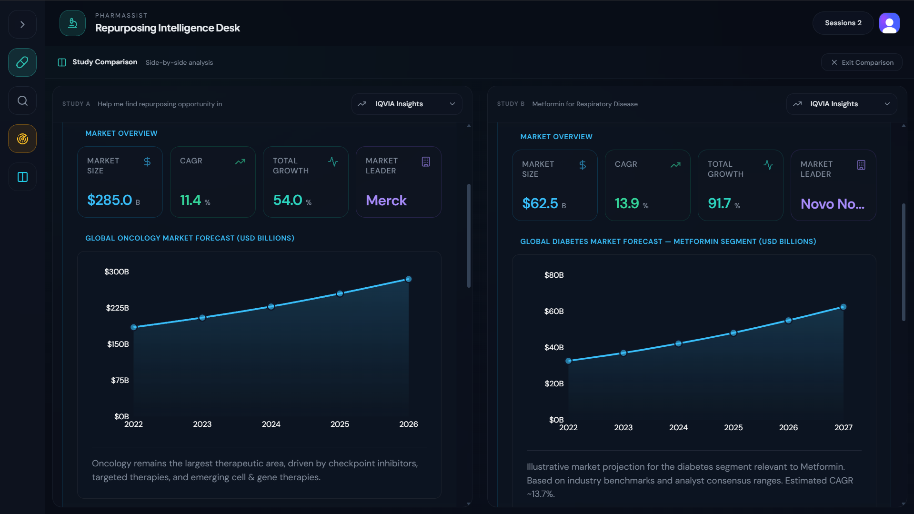
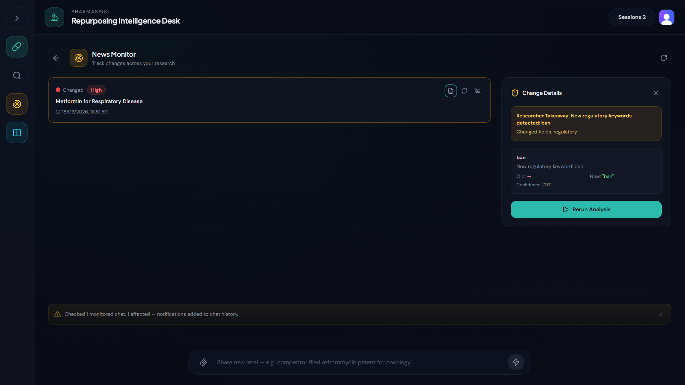

# PharmAssist

PharmAssist is a full-stack pharmaceutical intelligence platform for drug research and decision support. It combines a React frontend, FastAPI backend, MongoDB session persistence, and a multi-agent workflow that can analyze market, clinical, patent, trade, internal, and public web signals in one run.

## Quick Agent Links

- [IQVIA Agent](#iqvia-agent)
- [Patent Agent](#patent-agent)
- [Internal Knowledge Agent](#internal-knowledge-agent)
- [Web Intelligence Agent](#web-intelligence-agent)
- [Report Generator Agent](#report-generator-agent)
- [Clinical Trials Agent](#clinical-trials-agent)
- [EXIM Agent](#exim-agent)
- [Monitor Agent (News / Change Detection)](#monitor-agent-news--change-detection)

## Agentic Workflow At A Glance

This platform includes the following core agents:
- IQVIA Agent
- Patent Agent
- Internal Knowledge Agent
- Web Intelligence Agent
- Report Generator Agent
- Clinical Trials Agent
- EXIM Agent
- Monitor Agent (News/Change Detection)

Quick links to each agent are available in [Agent Reference](#agent-reference) at the end of this README.

## How The Agentic Workflow Works

1. User submits a research query from the UI.
2. Planner classifies query and builds/clarifies an execution plan.
3. Orchestrator extracts shared parameters once (drug, indication, geography, etc.).
4. Selected agents run with shared context and return structured payloads.
5. Results are stored under session history (`agentsData`) for continuity.
6. Report Generator can synthesize outputs into report-ready artifacts.
7. Monitor Agent can track changes and trigger rechecks/notifications.

### Orchestration Notes
- The orchestrator enforces inclusion of the Web Intelligence Agent in normal analysis flow.
- Agent runs are session-aware and can reuse prior context from earlier prompts in the same chat.
- News/Monitor checks are optional and generally triggered by monitoring actions.

## Tech Stack
- Frontend: React + Vite + Tailwind + Clerk
- Backend: FastAPI + Python agent modules + MongoDB
- Auth: Clerk
- LLM layer: Groq-hosted models (via CrewAI/LangChain integrations)
- Optional runtime path: Docker Compose for backend container

## Repository Structure

```text
pharmassist/
  backend/      FastAPI app, orchestrator, agents, workers, tests
  frontend/     React/Vite client app
  Screenshots/  UI screenshots used in this README
  docs/         Setup and reference docs
```

## Product Screenshots

### Landing Page


### Research Workspace



### Comparison View


### News Monitor


## Local Development

### 1) Prerequisites
- Python 3.10+
- Node.js 18+
- npm
- MongoDB (local or hosted)

### 2) Configure Environment Variables
- Use [docs/ENV_SETUP_REFERENCE.md](docs/ENV_SETUP_REFERENCE.md)
- Create `backend/.env` and `frontend/.env`
- Do not commit real credentials

### 3) Run Backend
From `backend/`:

```bash
python -m venv .venv
# Windows PowerShell
.\.venv\Scripts\Activate.ps1
pip install -r requirements.txt
uvicorn app.api.main:app --host 0.0.0.0 --port 8000 --reload
```

Backend API: `http://localhost:8000`

### 4) Run Frontend
From `frontend/`:

```bash
npm install
npm run dev
```

Frontend app: `http://localhost:5173`

## Docker (Backend)

```bash
docker compose up --build backend
```

Uses `backend/.env` through `docker-compose.yml`.

## Security Notes
- `.env` files are ignored by Git.
- `.env.example` files are placeholders only.
- If secrets were exposed in previous commits/history, rotate them immediately.

## Common Commands
- Frontend lint: `npm run lint` (from `frontend/`)
- Backend run: `uvicorn app.api.main:app --reload` (from `backend/`)

---

## Agent Reference

### IQVIA Agent
**Module:** `backend/app/agents/iqvia_agent/iqvia_agent.py`

**Purpose**
- Market intelligence for pharmaceuticals (market size, CAGR, competitive landscape, visual evidence).

**Typical Inputs**
- Drug / indication / therapy area.

**Core Outputs**
- Market summary, growth analysis, competition insights, data-source-grounded findings.

---

### Patent Agent
**Module:** `backend/app/agents/patent_agent/patent_agent.py`

**Purpose**
- Freedom-to-operate (FTO) analysis for drug-disease combinations.

**Typical Inputs**
- Drug, disease, jurisdiction.

**Core Outputs**
- FTO status (`CLEAR`, `LOW_RISK`, `MODERATE_RISK`, `HIGH_RISK` style outcomes), blocking patent summary, earliest freedom date, action guidance.

---

### Internal Knowledge Agent
**Module:** `backend/app/agents/internal_knowledge_agent/internal_knowledge_agent.py`

**Purpose**
- Session-specific internal document analysis (PDF/PPTX/XLSX/DOCX/TXT/CSV parsing + synthesis).

**Typical Inputs**
- Uploaded internal documents + user query focus.

**Core Outputs**
- Document overview, key findings, strategic implications, recommendations, extracted internal data points.

---

### Web Intelligence Agent
**Module:** `backend/app/agents/web_intelligence_agent/web_intelligence_agent.py`

**Purpose**
- Real-time public web signals: trends, news, forums, sentiment, and summarized evidence.

**Typical Inputs**
- Drug and/or disease, region, time span.

**Core Outputs**
- Signal score, curated headlines, forum sentiment, visual widgets, source-linked summary.

---

### Report Generator Agent
**Module:** `backend/app/agents/report_generator_agent/report_generator_agent.py`

**Purpose**
- Aggregate multi-agent outputs into executive report structures (HTML/PDF workflow support).

**Typical Inputs**
- Agent response bundle from market/clinical/patent/exim/internal/web modules.

**Core Outputs**
- Opportunity score, key takeaways, recommendation layer, report-ready content blocks.

---

### Clinical Trials Agent
**Module:** `backend/app/agents/clinical_agent/clinical_agent.py`

**Purpose**
- Clinical pipeline intelligence (active trials, phase distribution, sponsor profile, maturity assessment).

**Typical Inputs**
- Drug and/or condition, optional phase/status filters.

**Core Outputs**
- Trial inventory summary, phase mix, sponsor concentration, feasibility signal.

---

### EXIM Agent
**Module:** `backend/app/agents/exim_agent/exim_agent.py`

**Purpose**
- Pharmaceutical trade analysis (exports/imports, partner concentration, sourcing risk/dependency).

**Typical Inputs**
- Product category/drug, year, country, trade direction.

**Core Outputs**
- Trade volume trends, partner analysis, dependency risk, sourcing insights.

---

### Monitor Agent (News / Change Detection)
**Modules:**
- `backend/app/agents/news_agent/news_agent.py`
- `backend/app/workers/news_monitor_worker.py`
- `backend/app/api/routes/news.py`

**Purpose**
- Detect material changes in monitored prompts/research assertions and notify users when re-evaluation is recommended.

**Typical Inputs**
- Existing prompt/session agent outputs, optional re-run outputs, optional newly uploaded internal doc text.

**Core Outputs**
- Change status, severity, changed fields, decision reason, notification persistence and chat alert insertion.

**API Endpoints**
- `POST /news/enable`
- `POST /news/recheck`
- `GET /news/monitored`
- `GET /news/details/{notificationId}`

---

### Agent Links (Quick Jump)
- [IQVIA Agent](#iqvia-agent)
- [Patent Agent](#patent-agent)
- [Internal Knowledge Agent](#internal-knowledge-agent)
- [Web Intelligence Agent](#web-intelligence-agent)
- [Report Generator Agent](#report-generator-agent)
- [Clinical Trials Agent](#clinical-trials-agent)
- [EXIM Agent](#exim-agent)
- [Monitor Agent (News / Change Detection)](#monitor-agent-news--change-detection)

## License
Use and distribute according to your organization or repository policy.
